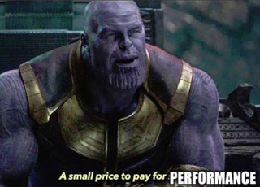
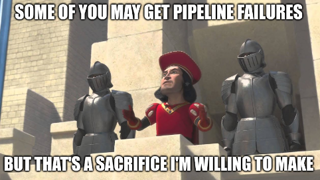
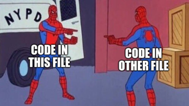
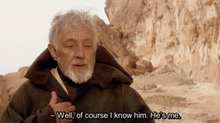
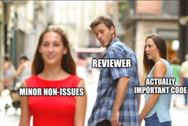
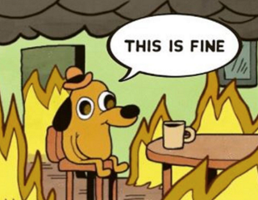
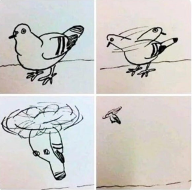
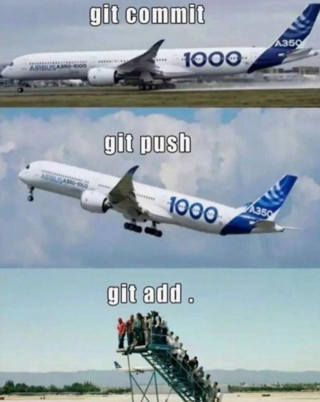

# looks-good-to-meme

Fun and maybe useful memes to spice up your code review,
with reasonable and consistent image sizes.

Feel free to browse and borrow, and no need to cite
this as source, either way it's mostly stolen out of
imgflip, programmerhumor.io and places...

## what you're here for

